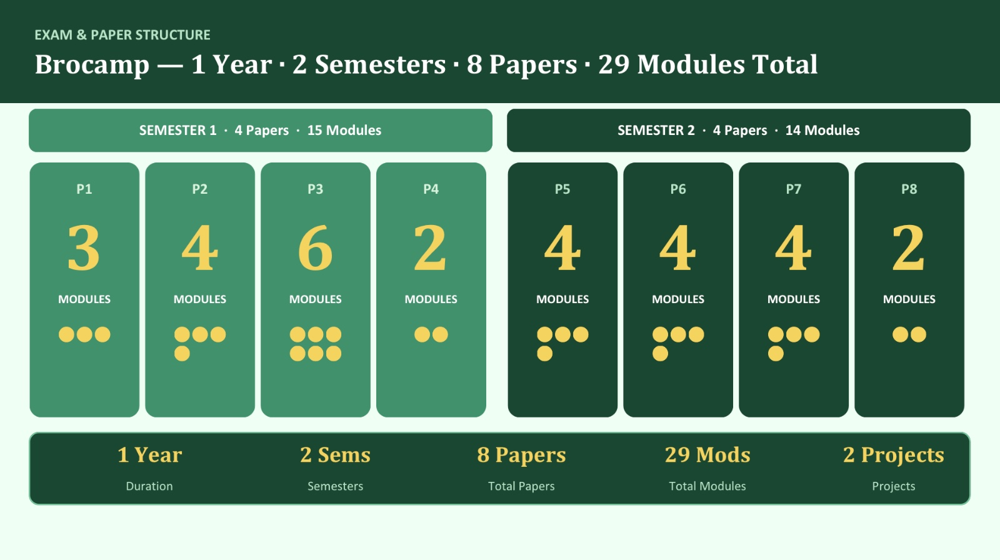

```text
Semester-1
├── PAPER_1 —> 3 Modules
├── PAPER_2 —> 4 Modules
├── PAPER_3 —> 6 Modules
└── PAPER_4 —> 2 Modules
      SEM-1 = 15 Modules

Semester-2
├── PAPER_5 —> 4 Modules
├── PAPER_6 —> 4 Modules
├── PAPER_7 —> 4 Modules
└── PAPER_8 —> 2 Modules
      SEM-2 = 14 Modules

Total = 29 Modules
```

