[◀ Back to Index](../../../../../README.md) &emsp; | &emsp;[◀ Back](./)

---
# Install VS Code
> 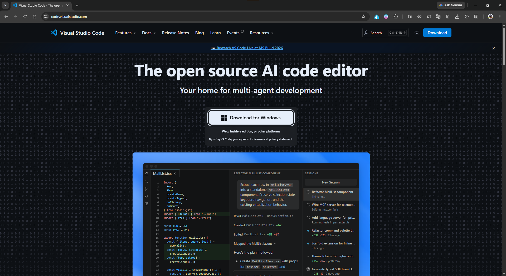
> 👆 Picture 1

> **Click the downloaded file to install it**   
> 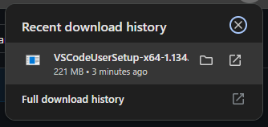 
> 👆 Picture 2

> 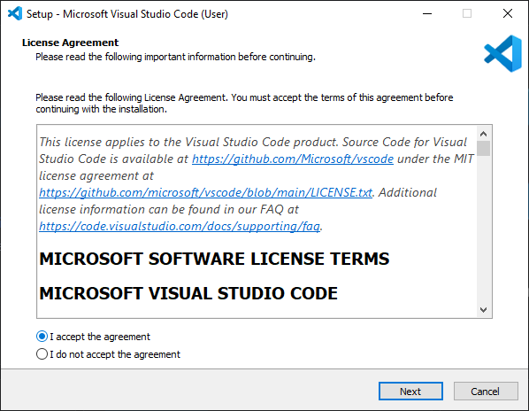
> 👆 Picture 3

> 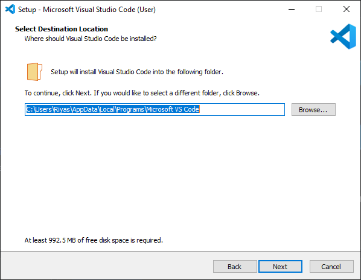
> 👆 Picture 4

> 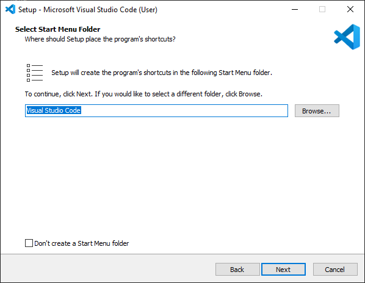
> 👆 Picture 5

> 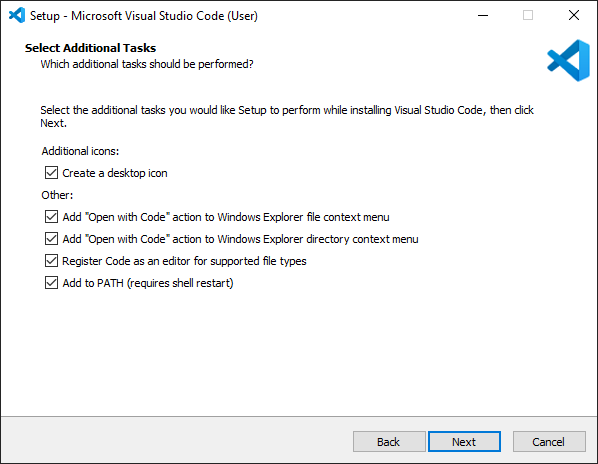
> 👆 Picture 6

> 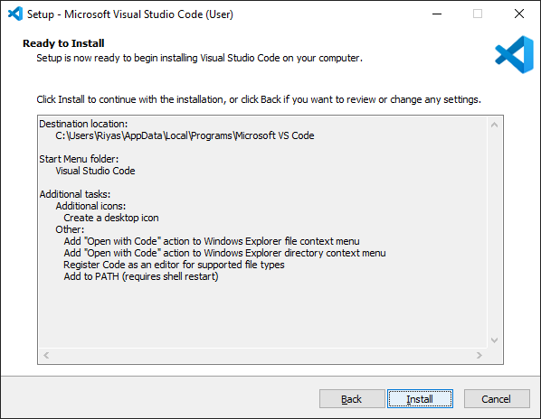
> 👆 Picture 7

> 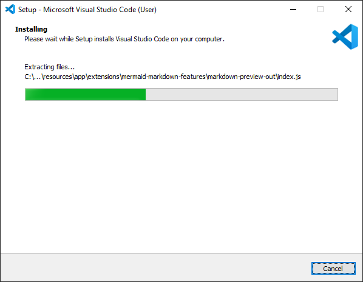
> 👆 Picture 8

> 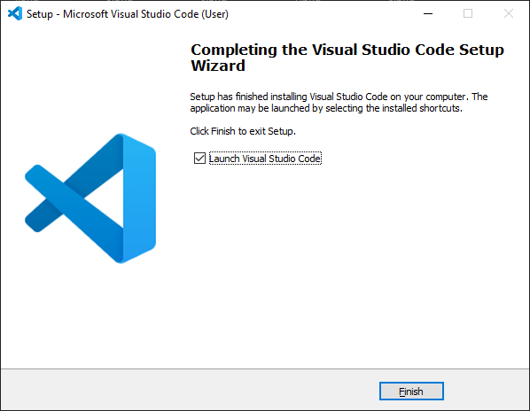
> 👆 Picture 9

> 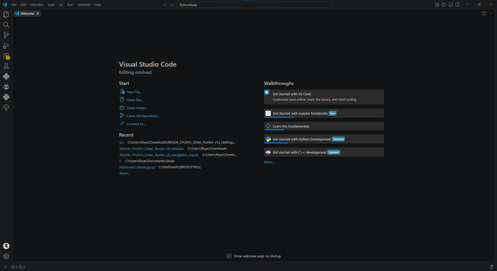
> 👆 Picture 10

> 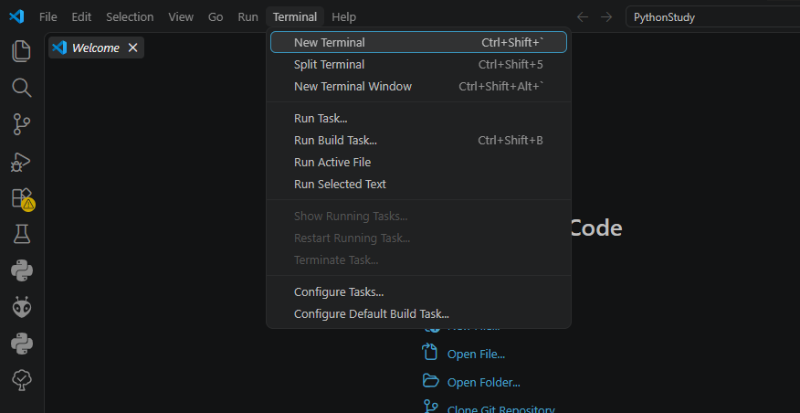 
> > 👆 Picture 11

> 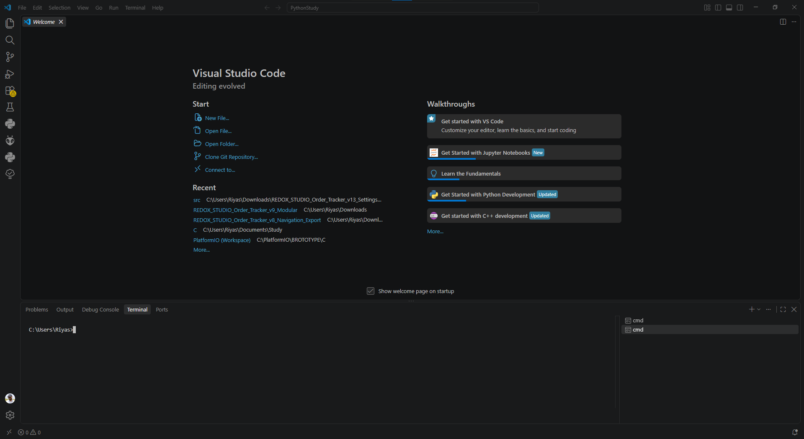 
> > 👆 Picture 12   
---
### Check, is the python installed!
**To find it that installed or not by checking its version**
Run these command in terminal: 
> 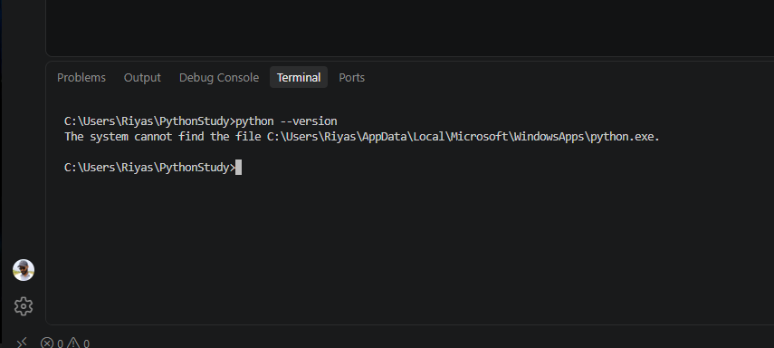 
> > 👆 Picture 13
(See the command and result in terminal) 
> Result somthing like: The system cannot find the file C:\Users\Riyas\AppData\Local\Microsoft\WindowsApps\python.exe.
> 
> It means python not installed

## Install Python

### Install python Extension pack
> 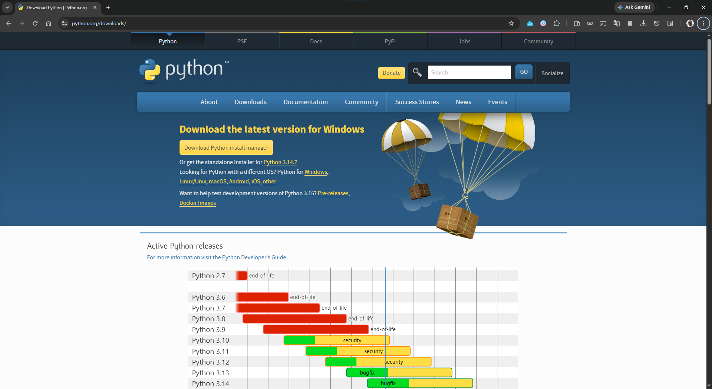 
> 👆 Picture 14  

> 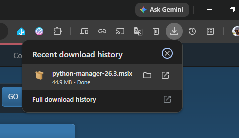 
> 👆 Picture 15

> 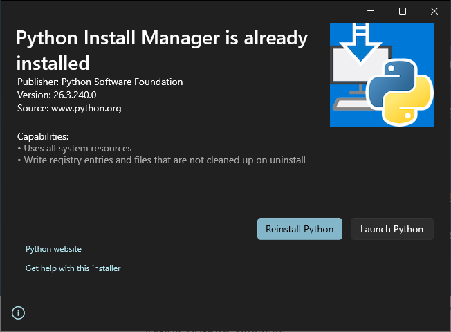 
> 👆 Picture 16 (Here may show Install if not installed already!)

> 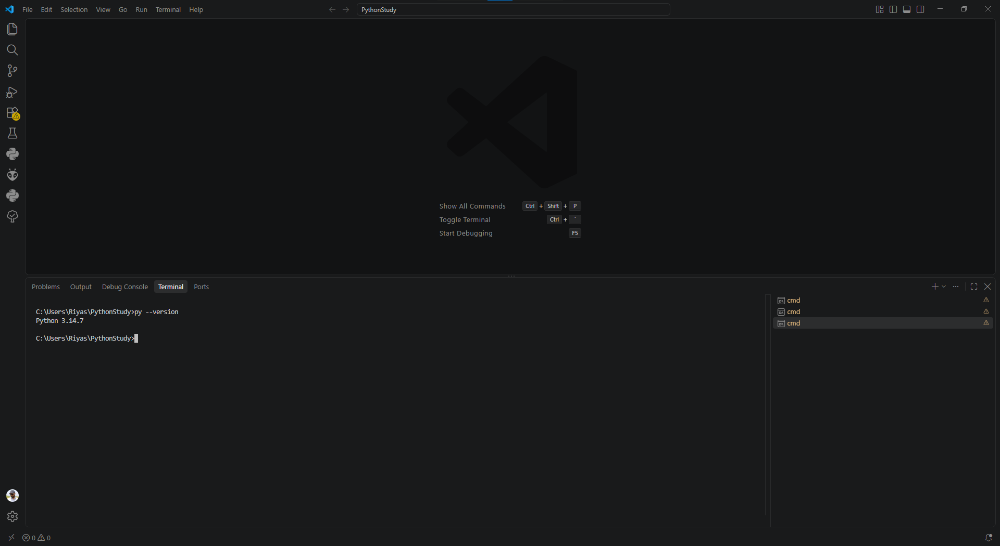 
> 👆 Picture 17 (Check version using this command: p)

# Install 
Run this Command on terminal:
`py -m pip install numpy pandas matplotlib scikit-learn`
> 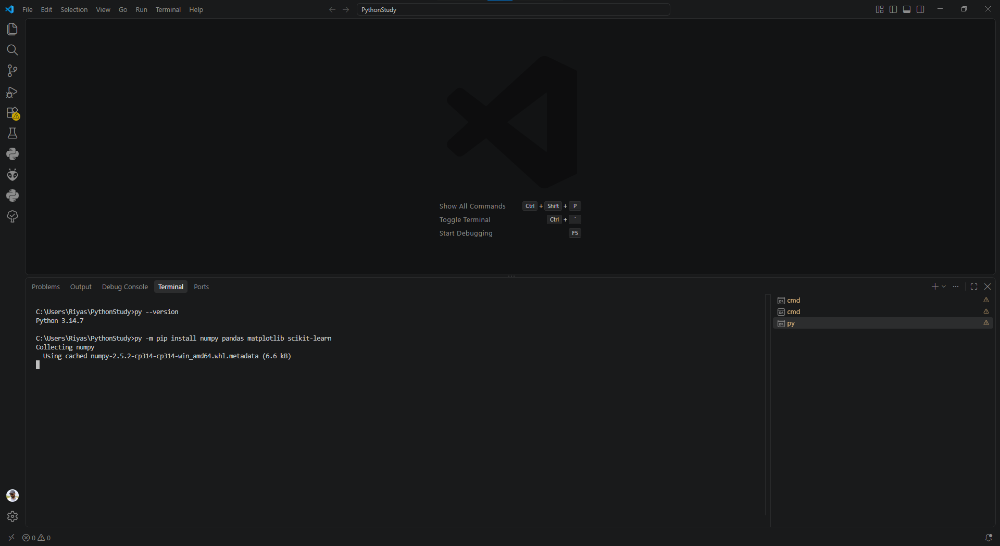 
> > 👆 Picture 18  (Installing numpy)

Then Verify using this command:  `py -c "import numpy, pandas, matplotlib, sklearn; print('All ML packages installed successfully')"`

## To Create Environment 
**Create using this command:** 
`py -m venv .venv` 
**Then Activate it using this command:** 
`.venv\Scripts\activate` 
**You should then see:** 
`(.venv) C:\Users\Riyas\PythonStudy>`

**After that, verify:** 
`python --version` 

## Jupyter Notebook setup.
**Use this command:** `python -m pip install jupyter`

**Then Check jupyter version:** `jupyter --version`  

`(.venv) C:\Users\Riyas\PythonStudy>jupyter --version 
Selected Jupyter core packages... 
IPython          : 9.16.1 
ipykernel        : 7.3.0 
ipywidgets       : 8.1.9 
jupyter_client   : 8.9.1 
jupyter_core     : 5.9.1 
jupyter_server   : 2.20.0 
jupyterlab       : 4.6.3 
nbclient         : 0.11.0 
nbconvert        : 7.17.1 
nbformat         : 5.11.1 
notebook         : 7.6.2 
qtconsole        : not installed 
traitlets        : 5.16.1 

(.venv) C:\Users\Riyas\PythonStudy>`

 

#### Launch jupyter.
- run this command: `jupyter notebook`  
Then should see this 👇

> 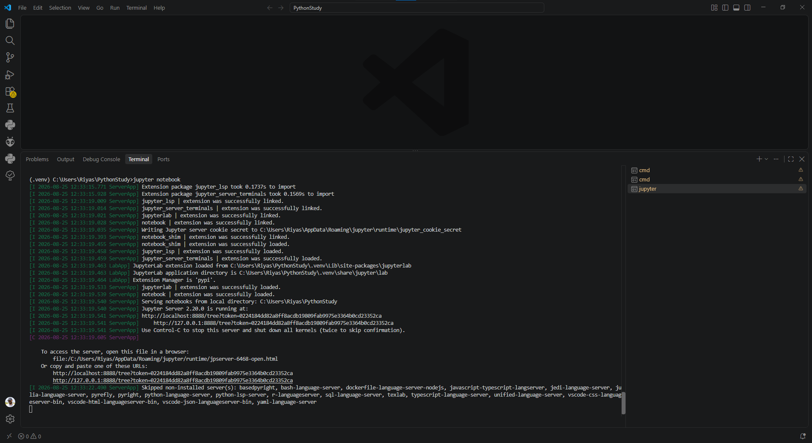 
> > 👆 Picture 19 

Open this link in browser using the link shown in the terminal:  
http://127.0.0.1:8888/tree?token=0224184dd82a8ff8acdb19809fab9975e3364b0cd23352ca

### On the browse see this Interface below is "jupyter notebook"

> 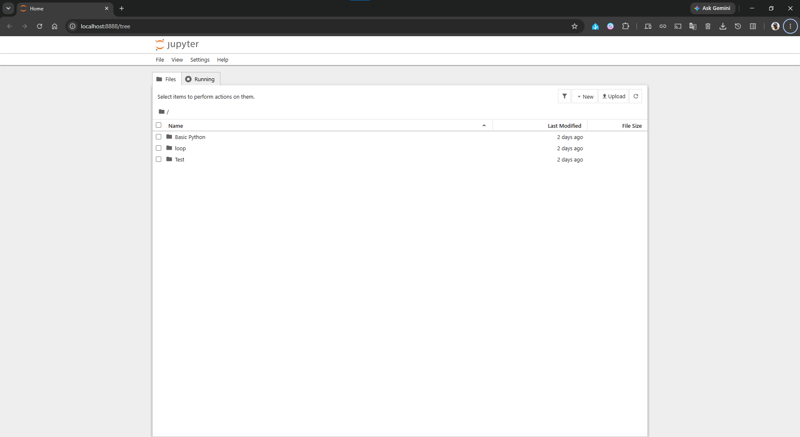 
> > 👆 Picture 20 ("jupyter notebook")

---

[◀ Back to Index](../../../../../README.md) &emsp; | &emsp;[◀ Back](./)